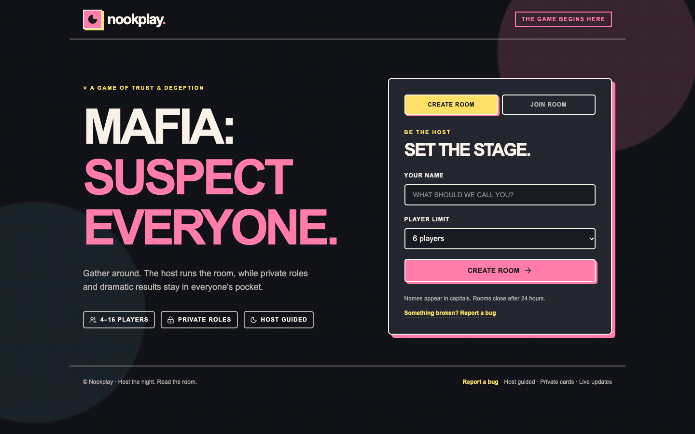
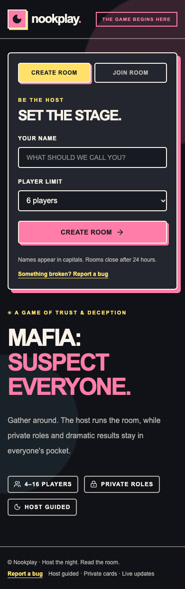
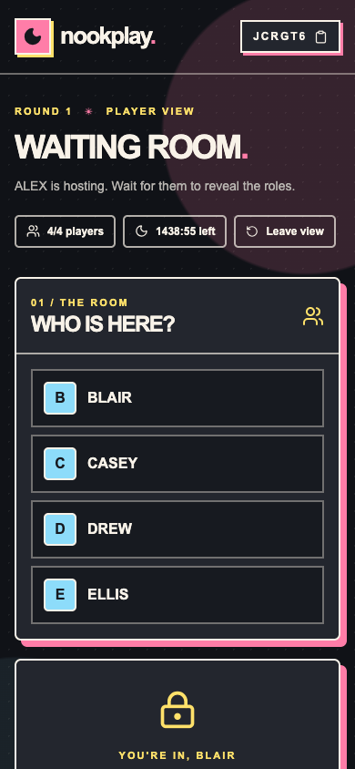
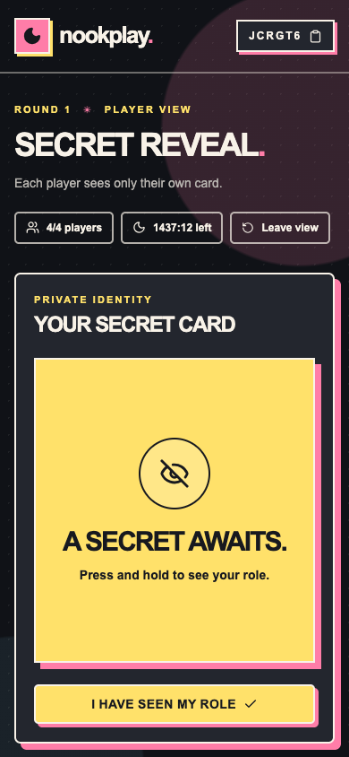
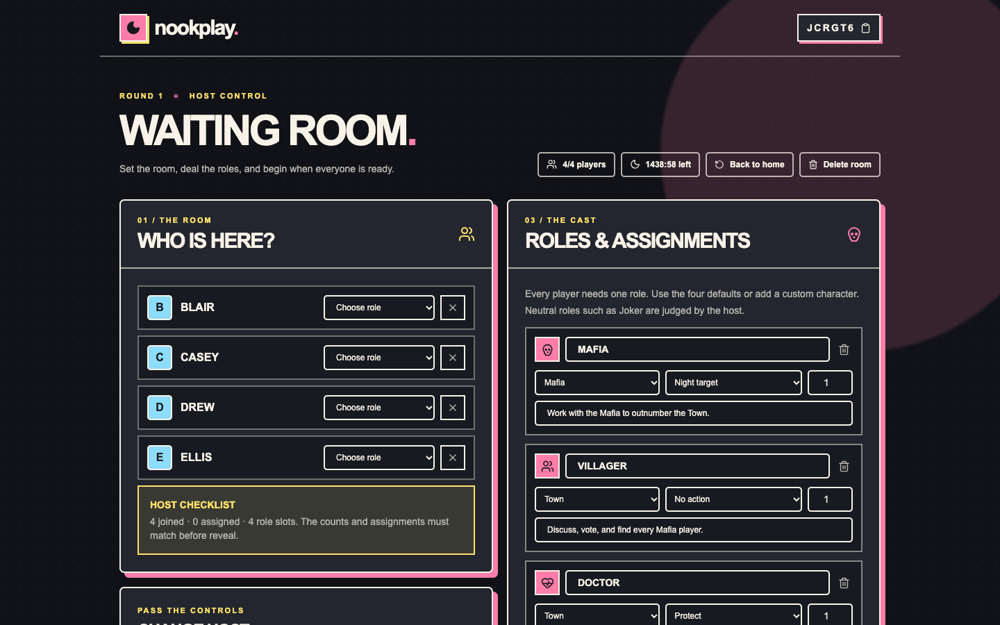
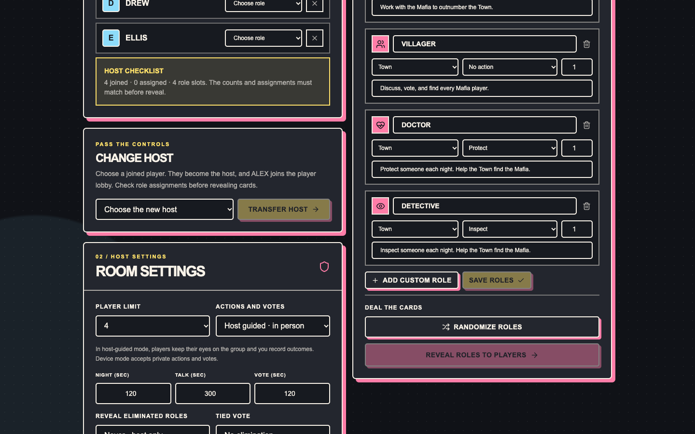

<div align="center">

# Nookplay

**MAFIA: SUSPECT EVERYONE.**

A phone-friendly companion for playing Mafia together, face to face. One host guides the room; everyone else gets a private card and clear announcements.

[Play now](https://nookplay.vercel.app) · [How to play](#how-to-play) · [Contribute](#contributing) · [Report a bug](https://nookplay.vercel.app/report)



</div>

## At a glance

| | |
| --- | --- |
| **Game** | Host-guided Mafia for 4–16 players. |
| **Join** | Room code or invite link and a name. No player account or shared Wi-Fi. |
| **Pass & Play** | A separate one-phone Mafia mode with pass-around secret cards and a narrator dashboard. |
| **Host** | Sets roles, guides phases, records outcomes, sees the full roster, and can pass host controls to a player in the lobby. |
| **Players** | See only their own secret role and public announcements. |
| **Devices** | Responsive phone and desktop layouts. Room views refresh automatically about every two seconds. |
| **Room lifetime** | 24 hours from creation, or until the host deletes the room. |

Nookplay supports **Mafia** today. It helps the group play in person; it does not replace the host's voice, discussion, or eye-closed night routine. The default is **host-guided mode**. A separate **device mode** lets players submit private night actions and votes on their phones.

## Choose a way to play

### Room game

Create a room, share its code, and let every player join from their own phone. The host runs the game from a full control view while each player sees only their private role and public results. Use this for groups where everyone has a device nearby.

### Pass & Play Mafia

Open **Pass & Play** from the Nookplay home screen when the group wants to use one phone. The narrator adds a 4–12 digit PIN, chooses role counts and timers, then either shuffles the deck or assigns every card manually. Deal one private card at a time, pass the phone to each player, and use the PIN to return it to narrator control. The narrator then uses role cards and player cards to record night choices, results, and votes. It is stored only in that browser session, so keep the phone with the narrator until the game ends.

## Screenshots

These are screenshots of the running app. The room codes shown were temporary demo rooms.

| Mobile home | Player lobby | Private role card |
| :---: | :---: | :---: |
|  |  |  |

| Desktop host lobby | Host handoff |
| :---: | :---: |
|  |  |

The [mobile host lobby](docs/images/mobile-host-lobby.png) shows how the controls fit on a phone after a host transfer.

## How to play

### 1. Create a room

The host opens [Nookplay](https://nookplay.vercel.app), enters a name, chooses a player limit, and shares the six-character room code or invite link. The host is **not** one of the players at this point. Players join on their own phones with the code and a name. Names appear in capitals.

### 2. Set up the cast

In the waiting room, the host adjusts role quantities so the total equals the joined player count. The defaults are Mafia, Villager, Doctor, and Detective. The host can assign each player's role or select **Randomize roles**. Custom roles can have a name, team, ability, quantity, and objective; a Neutral role such as Joker follows a win rule agreed by the group.

| Default role | Team | Night activity |
| --- | --- | --- |
| Mafia | Mafia | Chooses a target together. |
| Villager | Town | Sleeps; discusses and votes by day. |
| Doctor | Town | Protects one player. |
| Detective | Town | Inspects one player; the host signals whether they are Mafia. |

The host may change the player limit, timers, reveal policy, tie rule, and action mode while the room is in the waiting room. **Change host** passes control to a joined player. That player leaves the player list; the former host joins it and needs a role assignment before cards are revealed. Host transfer is available only in the waiting room.

### 3. Reveal private cards

The host selects **Reveal roles to players** once every player has an assigned role and the counts match. Each player presses and holds their card to see only their own role, team, ability, and objective. They can hide it again and mark themselves ready. No refresh is needed.

### 4. Play the night

The host starts night and asks everyone to close their eyes. The host calls Mafia, then Doctor, then Detective. In host-guided mode, the group gives choices in person and the host records them. In device mode, the relevant players submit private actions. The Doctor can stop the Mafia's chosen kill; tied Mafia choices cause no kill. The host announces the morning outcome.

### 5. Discuss and vote

The city wakes and sees who died, or that nobody died. Living players discuss face to face. The host opens voting when the group is ready. In host-guided mode, the host counts votes and records one or more eliminations. In device mode, each living player votes privately once; choices stay hidden until voting ends. A tie causes no elimination or a revote, according to the room setting. Eliminated players become spectators and cannot act or vote.

The public announcement shows names and outcomes. A player's exact role appears only if the host chose **Immediately** or **At game end** in room settings; **Never** keeps it host-only.

### 6. Start the next round or play again

Town wins when no Mafia remain alive. Mafia wins when living Mafia equal or outnumber living Town. Otherwise the host selects **Start round 2 · Night**, and the night → morning → discussion → voting cycle repeats. The host can declare a custom Neutral winner when the group's agreed rule is met.

After a game ends, **Play again** returns everyone to the lobby with names intact and roles, deaths, actions, votes, timers, and results cleared. The host can adjust the cast for the next game.

### Returning to a room

The browser saves room access locally. A host who closes the tab can choose **Resume hosting** on the same browser. A player can return with their saved browser access; if that access is gone, they can enter the room code and their previous name and ask the current host to approve recovery. Deleted or expired rooms cannot be rejoined.

## Run locally

**Requirements:** Node.js 20+, npm, and a Supabase project.

```bash
git clone https://github.com/bhavesh-03/Nookplay.git
cd Nookplay
npm install
cp .env.example .env.local
```

1. Apply [`202610040001_nookplay_rooms.sql`](supabase/migrations/202610040001_nookplay_rooms.sql) in the Supabase SQL Editor. Apply [`202610040002_room_expiry.sql`](supabase/migrations/202610040002_room_expiry.sql) for scheduled deletion of expired rows.
2. Set the server-side Supabase values in `.env.local`:

   ```env
   SUPABASE_URL=https://your-project-ref.supabase.co
   SUPABASE_SECRET_KEY=sb_secret_replace_me
   ```

   A legacy `SUPABASE_SERVICE_ROLE_KEY` also works. Never expose either key with a `NEXT_PUBLIC_` prefix.

3. Optionally set `NEXT_PUBLIC_FORMSPREE_FORM_ID` for the bug report form. See [Bug reports](#bug-reports).
4. Start the app with `npm run dev` and open [localhost:3000](http://localhost:3000). Use separate browsers or private windows to simulate several players.

## Architecture and privacy

| Path | Responsibility |
| --- | --- |
| `src/app/page.tsx` | Responsive home, lobby, private reveal, and game screens. |
| `src/lib/game.ts` | Rules, role visibility, host authority, phase changes, elimination, and win checks. |
| `src/lib/room-repository.ts` | Supabase persistence and revision checks for concurrent changes. |
| `src/app/api/rooms/` | Room creation, joining, recovery, updates, and deletion. |
| `src/app/report/` | Bug report form and Formspree submission. |
| `supabase/migrations/` | Database schema and scheduled expiry cleanup. |
| `tests/game.test.mjs` | Rules, privacy, recovery, transfer, and phase tests. |

The server validates host actions and decides what each viewer may see. The Supabase secret stays on the server. Room access tokens are stored as SHA-256 hashes in the database. Each update checks the room revision so concurrent actions do not silently overwrite each other. Phones poll for changes; Redis is not required. Room access ends after 24 hours even if the optional cleanup migration has not yet deleted the stored row.

## Development checks

```bash
npm run typecheck
npm test
npm run build
```

## Deployment

The production app runs on Vercel with a Supabase Postgres room store. Apply the migrations, set `SUPABASE_URL` and `SUPABASE_SECRET_KEY` in Vercel **Production** environment variables, and deploy. Set `NEXT_PUBLIC_FORMSPREE_FORM_ID` at build time if you want in-app bug reports. The Supabase key must stay server-only. The two-second browser polling works across networks and does not require players to share Wi-Fi.

## Contributing

Contributions are welcome. Read [CONTRIBUTING.md](CONTRIBUTING.md) for the full workflow and pull request checklist. In short:

1. Search [issues](https://github.com/bhavesh-03/Nookplay/issues) and open one for a new game or a substantial rules change.
2. Fork the repo, create a focused branch, and make the change.
3. Keep the phone experience usable and validate private information on the server.
4. Run the development checks above, then open a pull request with behavior notes and screenshots for UI changes.

**Adding a game:** open a [new game proposal](https://github.com/bhavesh-03/Nookplay/issues/new?template=game_proposal.yml) describing player count, setup, private information, host duties, phases, ties, eliminations, and win conditions. Mafia is currently the only game; a new game needs its own rules and screens, with tests for secrecy and phase transitions. See the [new game guide](CONTRIBUTING.md#adding-a-new-game).

## Bug reports

Use the [in-app form](https://nookplay.vercel.app/report) or [GitHub's bug report template](https://github.com/bhavesh-03/Nookplay/issues/new?template=bug_report.yml). Include expected and actual behavior, steps to reproduce, and your browser/device. Do not include room tokens, passwords, or private roles from a live game.

Formspree delivers in-app reports. To configure another deployment, create a form in [Formspree](https://formspree.io/), choose its notification inbox, and copy the ID from `https://formspree.io/f/FORM_ID` into `NEXT_PUBLIC_FORMSPREE_FORM_ID`. The form ID is public; no SMTP password is needed. Redeploy after setting it, then submit one test report and check both Formspree's submissions and the destination inbox. If no ID is configured, the form points reporters to GitHub Issues.

## License

Nookplay is available under the [MIT License](LICENSE).
